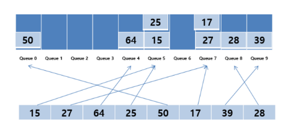

# 기수 정렬

## 🍀 기수 정렬이란?

- 비교하지 않는 정렬 알고리즘
- 낮은 자릿수부터 정렬 수행

1. 십진수에서 각 자릿수에는 0부터 9까지 숫자가 올 수 있음
2. 숫자별로 버킷이라는 큐를 생성
3. 정렬하려는 숫자들의 각 자릿수에 해당하는 숫자를 각각의 버킷에 넣어 정렬하고 이를 자릿수만큼 반복.

- 시간 복잡도: 데이터 개수 n, 최대 자릿수 d일 때, O(dn)
- 버킷 구성을 위한 추가 메모리 필요 및 정렬할 수 있는 데이터 타입 한정적.

---

## 👣 예상 질문 List

### 1. 비교하지 않고 배열을 정렬할 수 있는 방법은 무엇인가요?

비교하지 않고 배열을 정렬하는 방법으로는 기수 정렬과 계수 정렬이 있다. 기수 정렬은 낮은 자릿수부터 정렬을 수행한다. 계수 정렬은 데이터의 범위를 인덱스로 갖는 배열을 생성한 뒤에 데이터 개수를 세는 방법이다. 두 정렬 방법 모두 비교 정렬 대비 시간 복잡도 측면에서 효율적이지만 메모리가 낭비될 수 있다는 단점이 있다.