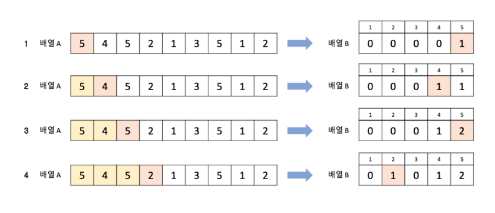

# 계수 정렬

## 🍀 계수 정렬이란?

- 기수 정렬과 마찬가지로 비교하지 않는 정렬 알고리즘
- 데이터의 개수를 세서 정렬

1. 정렬하려는 데이터의 범위를 인덱스로 갖는 빈 배열 생성
2. 정렬하려는 배열을 순회하며 데이터에 해당하는 인덱스의 값을 1씩 증가시킴. → 이 때문에 데이터의 범위가 0 또는 양의 정수여야 한다는 제약 조건 有

- 시간 복잡도: 정렬하려는 데이터의 개수 n, 데이터의 최댓값 k일 때, O(n+k). 데이터의 최댓값이 무한대에 수렴하면 시간 복잡도 역시 무한으로 수렴.
- 데이터 범위만 한 크기의 배열을 생성해야하기 때문에 추가로 사용하는 메모리 공간이 있다는 점을 주의해야 한다.

---

## 👣 예상 질문 List

### 1. **계수 정렬의 장점은 무엇인가요?**

우선, 계수 정렬은 비교 연산을 사용하지 않고 데이터의 출현 빈도를 계수하는 과정만 거치기 때문에 매우 빠른 속도로 정렬할 수 있다. 

또한, 추가적인 공간 복잡도가 상대적으로 낮다. 계수 정렬은 데이터의 출현 빈도를 세기 위한 배열을 사용하는데 이 배열의 크기는 데이터의 범위에 비례하므로, 데이터의 범위가 크지 않은 경우에는 추가적인 공간 복잡도가 낮다고 할 수 있다.