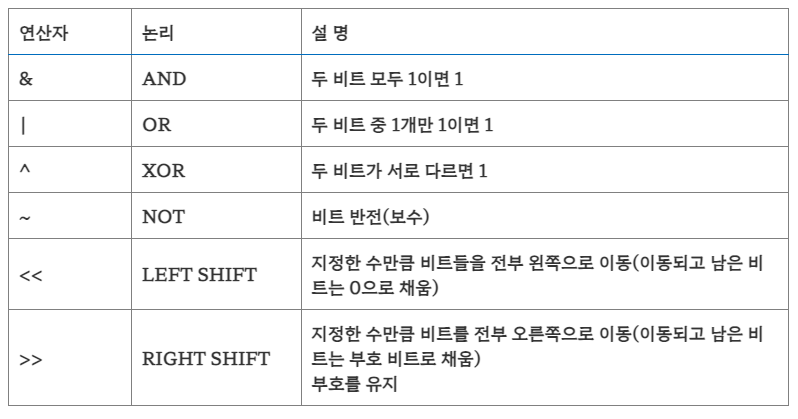
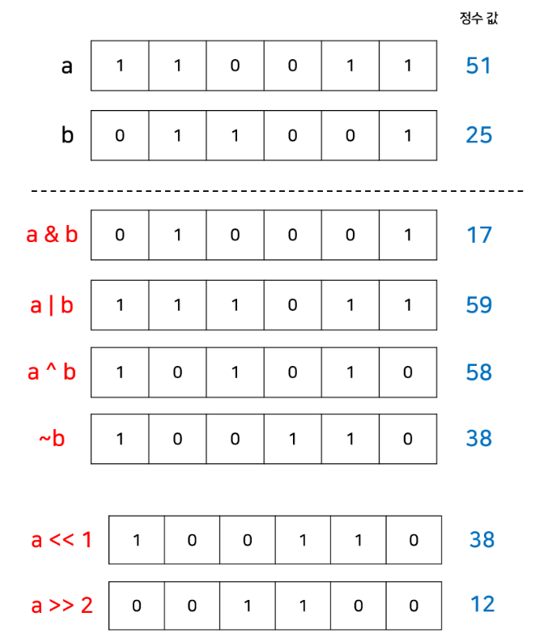

# 비트마스크

## 🍀 비트마스크란?

- 정수의 이진수 표현을 자료 구조로 쓰는 기법.
- 비트가 1이면 "켜져 있다", 0이면"꺼져 있다"라고 말함.

### 비트마스크 사용 이유

1. `빠른 수행시간`: 원소의 수가 많지 않을 때 사용 + 비트 연산이기 때문에 시간 복잡도 O(1)에 구현되는 것이 多.
2. `작은 메모리 사용량`: 하나의 정수로 매우 많은 경우의 수를 표현할 수 있기 때문에 메모리 측면에서 효율적. 데이터를 미리 계산하여 저장해 둘 수 있으므로 캐시 효율이 좋음.
3. `간결한 코드`: 다양한 집합 연산자들을 반복문 없이 한 줄에 쓸 수 있어 반복문, 조건문을 이용한 코드보다 훨씬 간결하게 코드를 작성할 수 있음.

**비트 논리 연산자**

### 비트마스크 이용 예시

**집합 구현**

- 하나의 bit가 하나의 원소를 의미
- bit가 켜져 있으면(bit = 1)해당 원소가 집합에 포함되어 있다는 의미, 꺼져 있으면(bit = 0) 포함되어 있지 않다는 의미.
- N비트 정수 변수라면 N개의 원소를 갖는 집합의 부분 집합 모두 표현 가능.

---

## 👣 예상 질문 List

### 1. **비트마스크를 사용하는 것이 다른 자료구조와 비교하여 어떤 장점이 있나요?**

첫째, 메모리 사용이 매우 효율적이다. 비트마스크는 0과 1로 이루어져 있으며, 각 비트는 단일 원소의 상태를 나타내므로 메모리 공간을 절약할 수 있다. 

둘째, AND, OR, XOR 등의 비트 연산을 통해 효율적이고 빠른 연산이 가능하다. 

마지막으로, 간결하고 직관적인 코드를 작성할 수 있다. 비트마스크를 사용하면 집합의 포함 여부, 조합 생성 등을 간결하게 표현할 수 있으며, 코드의 가독성을 높일 수 있다.