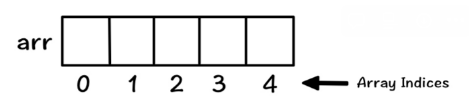

# 배열

## 🍀 배열이란?

- 선형 자료구조 + 정적 자료구조
- 구성: 요소(데이터) + 인덱스(번호)
- 배열의 인덱스는 1이 아닌 0부터 시작한다.
    
    
    
- 시간 복잡도
    - **`접근`**: O(1). 인덱스를 이용해 바로 접근 가능.
    - **`검색`**: O(n). 어떤 요소를 검색하기 위해서는 해당 인덱스까지 차례로 하나씩 탐색해야함.
    - **`삽입`, `삭제`**: O(n). 새로운 데이터를 추가하기 위해서 기존 데이터들을 재배치하는 시간이 필요. 단, 마지막에 삽입, 삭제 하는 경우는 예외적으로 O(1).

이러한 특징으로 배열은 

1. 데이터 개수가 고정적이고 삽입, 삭제가 빈번하지 않은 경우 
2. 데이터 접근이 빈번한 경우

인 상황에 유용하다.

- **`push()`** : 배열 마지막 인덱스에 요소 삽입
- **`pop()`** : 배열 마지막 인덱스 요소 제거
- 최근 JavaScript에는 **`sort()`**, **`reverse()`**, `**splice()**` 같이 원본 배열을 변경하여 사이드 이펙트를 발생시키고 의도하지 않은 결과를 초래할 수 있는 메서드 대신  **`toSorted()`**, **`toReversed()`**, **`toSpliced()`**와 같은 원본 배열을 복사한 뒤 이를 변경해서 반환하는 메서드가 등장했다.

---

## 👣 예상 질문 List

### 1. 배열의 가장 큰 특징과 그로 인해 발생하는 장점과 단점에 대해 설명해주세요.

배열의 가장 큰 특징은 순차적으로 데이터를 저장한다는 점이다. 데이터에 index를 부여하여 순서를 가지고 있기 때문에 index를 사용해 특정 요소를 빠르게 찾고 조작이 가능하다는 것이 Array의 장점이다. 다만, 데이터의 중간에 요소가 삽입되거나 삭제되는 경우 기존 요소를 이동해야 하는 단점도 있다. 이러한 이유로 Array는 정보가 자주 삭제되거나 추가되는 데이터를 저장하기에는 적절하지 않다.

### 2. 배열을 사용하면 좋을 데이터의 예를 구체적으로 들어주세요. 또한, Array를 적용하면 좋은 이유와 Array를 사용하지 않으면 어떻게 되는지 함께 설명해주세요.

배열을 사용하면 좋은 예로 주식 차트가 있다. 주식 차트에 대한 데이터는 요소가 중간에 새롭게 추가되거나 삭제되는 정보가 아니라 날짜 별로 주식 가격이 차례대로 저장되어야 한다.즉, 순서가 굉장히 중요한 데이터이므로 배열과 같이 순서를 보장해주는 자료구조를 사용하는 것이 좋다. 배열을 사용하지 않고 순서가 없는 자료 구조를 사용하는 경우에는 날짜 별 주식 가격을 확인하기 어려우며 매번 전체 자료를 읽어 들이고 비교해야 하는 번거로움이 발생하게 된다.