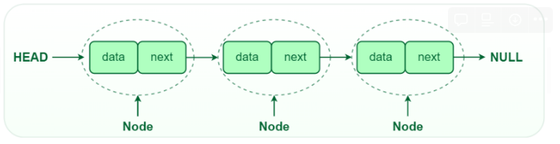
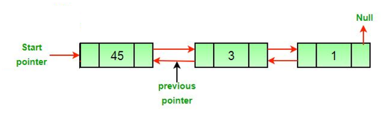
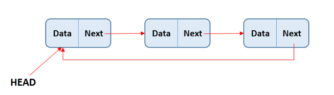

# 연결 리스트

## 🍀 연결 리스트란?

- 선형 자료구조 + 동적 자료구조
- 구성: 多 노드(데이터 + 다음 노드가 저장된 주소값)

- `Head` 포인터로 ‘`시작`’을, **Tail** 포인터로 ‘`끝`’을 알 수 있다. 여기서 첫 번째 노드는 Head 포인터가 가리키지만 마지막 노드는 가리킬 다음 노드가 존재하지 않는다. 그렇기 때문에 마지막 노드의 다음 주소 값은 **NULL**이 된다.
- 이러한 구조로 노드가 메모리에 연속적으로 저장되지 않아도 필요한 연산 수행 가능
    - 데이터 추가 + 삭제 → 자유로움(기존 노드들의 위치 변경 필요X)
        - 시간 복잡도:
            - **`O(1)`**: 맨 앞에 데이터를 추가, 삭제 시
            - **`O(n)`**: 맨 앞 제외 다른 위치가 추가, 삭제 시. 그 위치로 이동할 필요有
    - 데이터 접근 → 시간 多 (인덱스가 없기 때문)
        - 시간 복잡도:
            - **`O(n)`**: 특정 데이터 검색 시 하나씩 값을 확인해야 함.

## 🍀 연결 리스트 종류

앞서 설명한 연결 리스트는 단순 연결 리스트에 해당한다.

1. **이중 연결 리스트**
    - 앞 노드 주소 값 + 다음 노드 주소 값 모두 저장 → **양방향 탐색** 가능
    - 구현 어려움 + 주소 값 2개 저장 시 필요한 메모리 양 증가
    
    
    
2. **원형 연결 리스트**
    - 마지막 노드가 첫 번째 노드의 주소 값을 가리키는 구조 → 삽입, 삭제 연산 효율 🔼
    - 순환 구조 → 어떤 노드에서든 다른 노드에 모두 접근 가능.
    
    
    
---

## 👣 예상 질문 List

### 1. 배열과 연결 리스트의 차이점을 설명해보세요.

배열과 연결 리스트는 데이터를 저장하기 위한 자료구조로, 데이터 저장 방식에 차이가 있다. 배열은 연속된 메모리 공간에 데이터를 저장한다. 그렇기 때문에 특정 인덱스의 데이터에 한 번에 접근할 수 있어서 읽는 속도가 빠르다. 하지만 데이터 삭제, 삽입 시 요소들의 인덱스를 수정해야 하기 때문에 비교적 시간이 오래 걸린다.

반면, 연결 리스트는 노드를 이용해 메모리 공간에 데이터를 불연속적으로 저장한다. 각 노드는 데이터와 다음 노드의 주소 값을 저장하고 있어서 다른 노드에 접근할 수 있다. 배열과 달리 인덱스가 없기 때문에 한 번에 특정 데이터에 접근할 수는 없지만 데이터의 삽입, 삭제 시 노드가 가리키는 주소 값만 변경하면 되기 때문에 속도가 빠르다는 장점이 있다.

### 2. 단순 연결 리스트를 역순으로 출력하는 방법을 설명해보세요.

단순 연결 리스트를 역순으로 출력하는 방법으로는 스택에 연결 리스트의 요소를 순차적으로 넣고 빼는 방법이 있다. 이 방법은 스택을 사용하므로 추가 메모리가 필요하다. 메모리에 여유가 없다면 반복문을 이용해 다음 노드가 가리키는 노드를 이전 노드로 바꿔서 역순으로 된 연결 리스트를 얻는 방법도 있다.