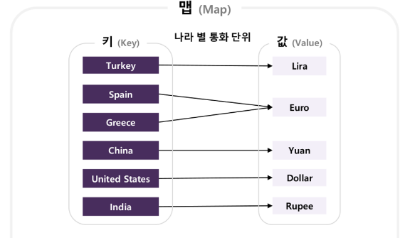

# 맵

## 🍀 맵이란?

- 키를 이용해 연관된 데이터를 빠르게 검색할 수 있는 자료구조
- 비선형
- iterator 특징. 순회할 수 있는 객체적 특징을 가짐.

맵 예시

- 키와 값의 매핑 관계 관리
- 키는 유일해야함 but 값은 중복 가능
- 시간 복잡도
    |||
    |-----|-------|
    | 검색 | O(1) |
    | 삽입 | O(1) |
    | 삭제 | O(1) |
    | 키 존재 확인 | O(1) |

### 기본 메서드

- size() : map의 길이(저장된 데이터의 개수) 반환.
- put() : data 삽입.
- get() : 값 가져오기.
- containsKey() : 키의 유무 확인.
- remove() : 값 삭제.

---

## 👣 예상 질문 List

### 1. 맵(Map)이란 무엇인가요?

맵은 키와 값으로 이루어진 자료구조이다. 키를 통해 해당 값에 접근할 수 있다. 키는 유일해야 한다는 특징이 있지만 키와 연결된 값은 중복이 가능하다.

### 2. 맵과 배열(Array)의 차이점은 무엇인가요?

맵과 배열은 데이터를 저장하고 접근하는 방식에서 차이가 있다. 배열은 인덱스를 사용하여 데이터에 접근하며, 데이터의 순서가 중요하다. 하지만 맵은 키-값 쌍으로 데이터를 저장하고, 키를 통해 값을 접근한다. 맵은 데이터의 순서를 보장하지 않으며, 키를 통해 빠르게 값을 찾을 수 있는 장점이 있습니다.