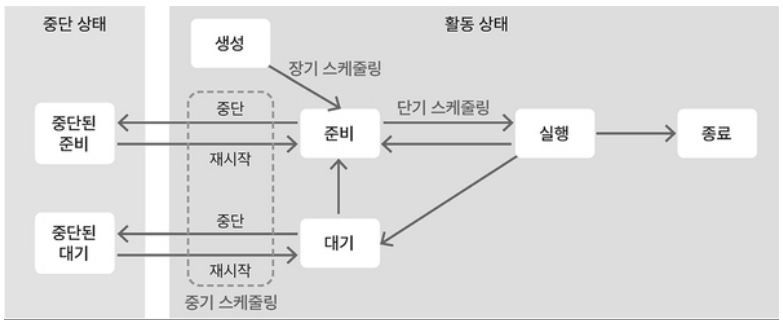
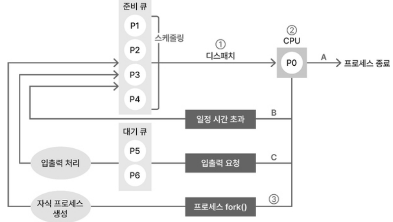

## 🍀 스케줄링의 목적

**멀티 프로세스 환경에서 모든 프로세스를 공평하게 실행하는 것.**

1. **`공평성`**: 모든 프로세스는 공평하게 실행되어야 한다. 특정 프로세스가 실행되지 않는 경우가 없도록.
2. **`효율성`**: 자원을 효율적으로 사용해 사용되지 않는 시간이 없도록. 
3. **`안정성`**: 우선순위를 고려해 높은 우선순위의 프로세스를 먼저 처리하도록.
4. **`반응 시간 보장`**: 프로세스가 오랜 시간 응답이 없으면 사용자는 시스템이 멈춘 것으로 보기 때문에 일정 시간 내에 응답할 수 있도록.
5. **`무한 연기 방지`**: 특정 프로세스에 대한 처리가 무한히 연기되지 않도록.

## 🍀 스케줄링의 단계

1. **장기 스케줄링** (== 잡 스케줄링 == 승인 스케줄링)
    1. 준비 큐에 어떤 프로세스 넣을지 결정 → 메모리에 올라가는 프로세스 수 조절.
2. **중기 스케줄링**
    1. 메모리에 로드된 프로세스 수 동적으로 조절.
    2. 프로세스 多 로드시, 스왑 아웃하여 일부 프로세스 통째로 저장.
    3. 스왑 아웃된 프로세스 → 중단 상태
        1. 준비 상태에서 스왑 아웃 → 중단된 준비 상태
        2. 대기 상태에서         ``       → 중단된 대기 상태
3. **단기 스케줄링**
    1. 준비 큐에 있는 대기 상태 프로세스 중 어떤 프로세스를 다음으로 실행할지 스케줄링 알고리즘으로 결정. (어떤 프로세스를 디스패치할지 결정. → cpu 스케줄링)

스케줄링 단계

스케줄러 관점에서 스케줄링

1. 스케줄러가 준비 큐에 있는 프로세스 중 하나 선택해 cpu에 디스패치 (스케줄링 알고리즘 이용)
2. CPU에서 프로세스 실행 (실행 상태) → 완료 → 프로세스 종료
    1. 일정 시간 초과: 인터럽트 발생 → 프로세스가 준비 큐에 들어감 (준비 상태)
    2. 입출력 요청: 인터럽트 발생: 프로세스가 대기 큐로 들어감 (대기 상태) → 완료 → 프로세스는 준비 큐로 들어감
3. fork() 호출 → 자식 프로세스 생성 → 준비 큐로 들어감

---

## 👣 예상 질문 List

### 1. 스케줄링의 단계에는 크게 장기, 중기, 단기 스케줄링이 있습니다. 그 중 중기 스케줄링에 대해서 설명해주세요.

메모리에 로드된 프로세스 수 동적으로 조절하는 스케줄링이다. 메모리에 프로세스가 많이 로드되면 스왑 아웃하여 일부 프로세스 통째로 저장한다. 스왑 아웃된 프로세스는 중단 상태가 된다.  이때 중단 상태는 준비 상태에서 스왑 아웃된 중단된 준비 상태, 대기 상태에서 스왑 아웃된 중단된 대기 상태로 구분된다.

### 1 - 1. 스왑 아웃이라는 용어가 많이 언급이 되는데요. 스왑 아웃이 무엇인가요?

프로세스가 실행되려면 메모리에 로드되어야 한다. 그런데 메모리 공간보다 많은 프로세스가 로드되는 경우가 있다. 이럴 때 중기 스케줄러가 이벤트 발생을 기다리고 있는 프로세스를 통째로 저장 공간으로 옮겨 저장하는 데 이것이 스왑 아웃이다.